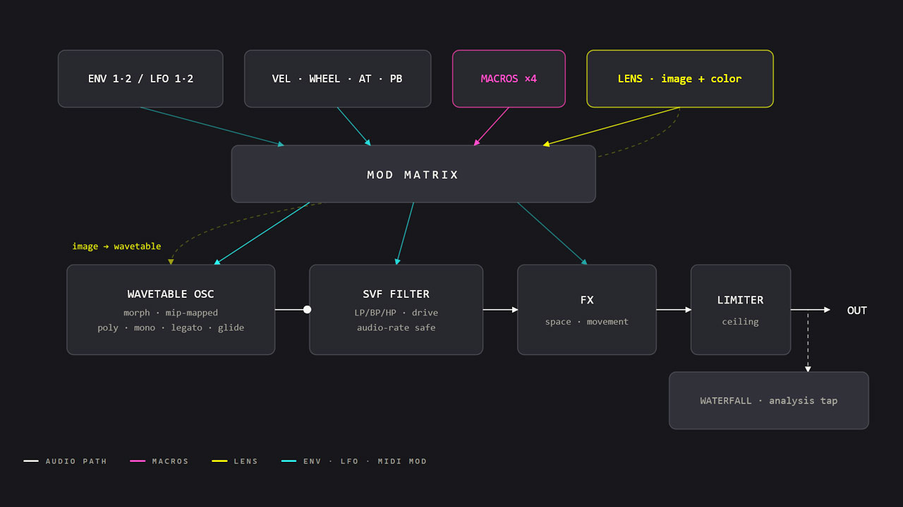
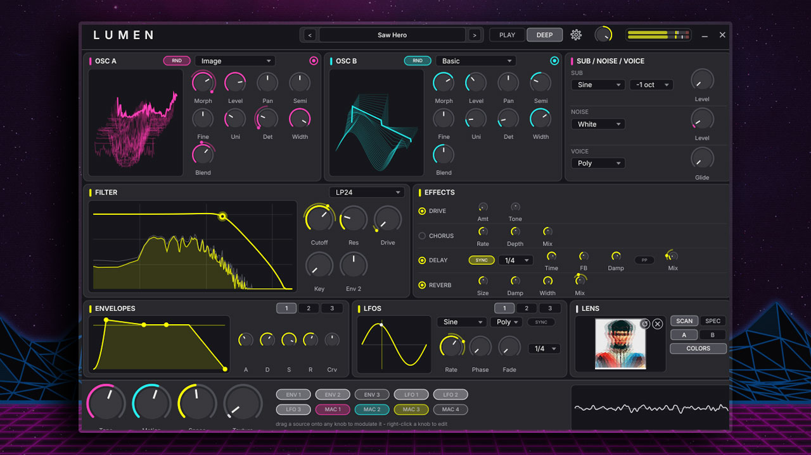
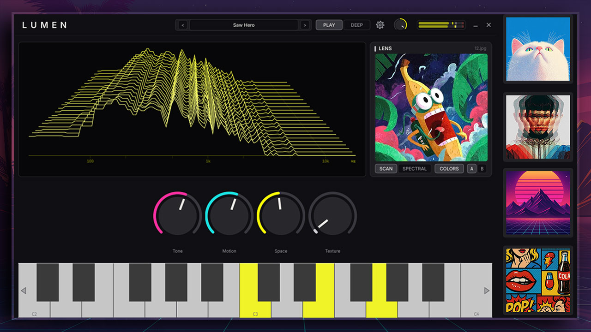

# Lumen

A wavetable synthesizer with a deterministic image-to-tone engine ("Lens").
Ships as a VST3 and a Windows standalone app. C++20 / JUCE 8.

## Quick start

1. Load **Lumen** in your host (or run the standalone). It opens on the
   *Slow Aurora* pad in the **Play** view: four macro knobs, a spectral
   waterfall, a Lens drop zone and a mouse-playable keyboard.
2. Turn **Tone / Motion / Space / Texture** — every preset maps all four.
3. Click the preset name in the header to browse the 32-preset factory bank.
4. Drop any photo onto the window. The image becomes a wavetable and (with
   **COLORS** on) sets the patch from the image's colors.
5. Press **DEEP** (top right) for the full editor.

## Signal flow

```
Osc A ─┐
Osc B ─┤
Sub   ─┼─ per-voice mix ─ SVF filter (drive) ─ voice amp (Env 1) ─ voice sum
Noise ─┘                                                            │
             Drive → Chorus → Delay → Reverb → Limiter → master gain/meter
```

Env 1 always drives voice volume; Env 2 is soft-wired to filter cutoff via
the **Env 2** amount knob on the filter; Env 3 is free. LFOs 1–3, the macros
and MIDI sources route anywhere through the modulation system below.

## The controls contract

Every knob behaves the same way:

- **Drag vertically** to change; hold **Shift** for fine adjustment.
- **Double-click** resets to the default; **mouse-wheel** steps.
- A value bubble shows while dragging; hovering shows a short tooltip.
- **Drag a source chip** (ENV/LFO/MAC, footer of the Deep view) onto any knob
  to modulate it. The dim arc shows the reachable span, the moving dot the
  live value.
- **Right-click** a knob to list/edit/remove its modulations, reset it, or
  bind hardware via MIDI Learn.

The modulation matrix itself (24 slots) is stored with the preset and is not
host-automatable in v1 — automate the four macros instead; they are ordinary
parameters and the first four the host sees.

## Voice modes & glide

The **VOICE** section (Deep view, top right): **Poly** plays chords (16
voices), **Mono** is one voice with last-note priority that retriggers on
every note, **Legato** ties overlapping notes without retriggering. **Glide**
slides the pitch between successive notes over the set time (mono/legato).
Factory examples: *Rubber* and *Laser* (mono + glide), *Neon Growl* (legato).

## Presets

- Factory bank: 32 presets in Bass / Leads / Pads / Keys / Textures — always
  present, never on disk.
- **Save Preset…** (bottom of the browser) asks only for a name and writes
  `Documents/Lumen/Presets/User/<Name>.lumen`. Everything you saved shows in
  one **User** section after the factory bank (any `.lumen` file anywhere
  under `Documents/Lumen/Presets/` is picked up on the next browser open).
- Presets store the full patch — including any Lens wavetable and thumbnail —
  so they recall bit-exactly even if the source photo is gone.

## Lens — image to tone

Drop a PNG/JPEG anywhere on the window (or click the dashed drop zone).

- **SCAN** reads image rows as waveforms — morphing travels down the image.
  **SPECTRAL** reads it as a spectrogram (top = high frequencies).
- **A/B** picks the destination oscillator.
- **COLORS** is on by default: a drop also *blends* the patch from the image —
  filter, envelope, drive, noise, macro positions — layered on top of the
  current sound rather than resetting it. Dropping onto a patch you like is
  safe: the **×** button removes the image and restores exactly the sound you
  had before the first drop.
- Every note also journeys through the image (a slow morph sweep wired to
  Env 3); the **Motion** macro sets how fast.
- Same image bytes → same sound, always, on any machine. Nothing is uploaded.

### Signal processing / tone math

This section describes the signal processing behind the **Lens** engine: how an
image is converted into a playable wavetable. There are two modes — **Scan** and
**Spectral**.

Notation: image `I(x, y) ∈ [0, 1]³` (RGB) has width `w` and height `h`. The
wavetable has `N = 64` frames, each with `M = 2048` samples.



*Figure 1 — LUMEN's signal flow: the Lens turns an image (plus its colors) into the wavetable that drives the oscillator, which then runs through the mod matrix, SVF filter, FX, and limiter to the output, with a waterfall analysis tap. Everything below concerns only the `image → wavetable` stage.*

#### Scan mode

Each of the 64 frames is generated by sampling a single row of the image and treating it as one period of a waveform.

**1. Row selection for frame `i`:**

$$y_i = \left\lfloor \frac{(i+0.5)}{N}(h-1) \right\rceil,\quad i = 0, \dots, N-1$$

**2. Luma (perceptual brightness) of a pixel:**

$$L(x,y) = 0.2126\,R(x,y) + 0.7152\,G(x,y) + 0.0722\,B(x,y)$$

**3. Row sampled to `M` points (linear interpolation) and converted to a bipolar signal:**

$$v_i[n] = 2\,\tilde{L}\!\left(\frac{n}{M-1}(w-1),\ y_i\right) - 1,\quad n = 0, \dots, M-1$$

**4. DC removal:**

$$\bar{v}_i[n] = v_i[n] - \frac{1}{M}\sum_{k=0}^{M-1} v_i[k]$$

**5. Silence guard + peak normalization:**

$$
s_i[n] =
\begin{cases}
0.05\sin\!\left(\dfrac{2\pi n}{M}\right) & \text{if } \max_n|\bar v_i[n]| < 10^{-4} \\[6pt]
0.9 \cdot \dfrac{\bar v_i[n]}{\max_n |\bar v_i[n]|} & \text{otherwise}
\end{cases}
$$

**6. Harmonic cap (mip build).** When the band-limited mip chain is built for these frames, harmonics are capped at 700 to tame extreme buzz from harsh rows.

Each frame `s_i` is one period of the oscillator waveform at that point in the wavetable. Morphing between frames scans down the image.



*Figure 2 — The DEEP view with OSC A in "Image" mode. The pink trace in the OSC A display is a wavetable frame `s_i` built from a loaded image by the pipeline above; OSC B beside it shows a conventional "Basic" wavetable for comparison.*

> Note: the silence-guard substitution is specified only as `0.05 · sin`; the single-period argument `2πn/M` shown above is the natural interpretation, not a value pinned by the spec.

#### Spectral mode

Each frame is instead built directly in the frequency domain, treating the image like a spectrogram (ANS synthesizer style).

**1. Amplitude of harmonic `h` (1 to 256) for frame `i`,** sampled from a 3×3 patch centered at `(x_i, y(h))`, where `x_i` maps frame index to image column and `y(h)` maps harmonic number logarithmically to image row (top of image = high frequencies):

$$A_i[h] = \left(\frac{1}{9}\sum_{(dx,dy)\,\in\,3\times3} L(x_i + dx,\ y(h) + dy)\right)^{1.5}$$

**2. Phase**, deterministically seeded from a hash of the (downscaled) image, rather than random noise:

$$\varphi_i[h] = 2\pi \cdot U\big(\text{FNV1a}_{64}(I_{\downarrow})\big) \in [0, 2\pi)$$

**3. Frame is the inverse DFT of the constructed complex spectrum, normalized to peak 0.9:**

$$X_i[n] = \mathrm{Re}\left( \sum_{h=1}^{256} A_i[h]\, e^{j(\varphi_i[h] + 2\pi h n / M)} \right)$$

$$s_i[n] = 0.9 \cdot \frac{X_i[n]}{\max_m |X_i[m]|}$$



*Figure 3 — The PLAY view. The Lens panel (right) toggles between Scan and Spectral; the central waterfall plots the harmonic spectrum of the played wavetable across roughly 100 Hz–10 kHz — the per-harmonic amplitudes `A_i[h]` of Spectral mode made visible.*

#### Playback: band-limited wavetable synthesis

Both modes feed the same playback engine.

**Mip levels.** At load time, each frame is analyzed via FFT and 10 mip levels are built, level `L` retaining harmonics up to:

$$H_L = \min(1023,\ 1024 / 2^L)$$

At play time, the highest-resolution mip level is chosen such that it stays band-limited for the current pitch:

$$H_L \cdot f_0 < 0.45\, f_s$$

where `f_0` is the played frequency and `f_s` is the sample rate. This prevents aliasing at high pitches.

**Frame morphing.** Between adjacent frames `i` and `i+1`, at fractional morph position `α ∈ [0, 1]`, an equal-power crossfade is applied:

$$\text{out}[n] = \cos\!\left(\frac{\pi \alpha}{2}\right) s_i[n \bmod M] + \sin\!\left(\frac{\pi \alpha}{2}\right) s_{i+1}[n \bmod M]$$

**Phase accumulation.** The read position `n` advances each sample according to:

$$\phi \mathrel{+}= \frac{f_0}{f_s} \cdot M$$

with linear interpolation between adjacent integer sample positions of `s_i`.

*Note: color-to-parameter mappings (filter cutoff, drive, etc.) are separate from this waveform-generation path and are not covered here.*

## MIDI Learn

Right-click any knob → **MIDI Learn** → move a hardware control: bound. The
same menu shows **Clear MIDI (CC n)** to unbind. The map is global — saved at
`%APPDATA%/Lumen/midi_map.xml`, shared by every instance and project, and it
survives restarts. Mod wheel (CC1) always drives the mod-wheel source even
when learned.

## Standalone notes

- The gear icon opens the audio/MIDI settings. Device, driver type and sample
  rate persist across restarts (`%APPDATA%/Lumen/Lumen.settings`); all MIDI
  inputs are enabled by default. WASAPI is the default backend.
- The header is the title bar: drag it to move the window; the buttons past
  the meter minimize/close.

## If something looks stale

Rescan pattern: reopen the preset browser to pick up new `.lumen` files;
delete `%APPDATA%/Lumen/Lumen.settings` to reset audio devices to defaults,
or `%APPDATA%/Lumen/midi_map.xml` to clear all MIDI bindings. If the host
cached an old plugin scan, rescan `C:\Program Files\Common Files\VST3`.

## Building

```
cmake -B build -G "Visual Studio 17 2022" -A x64
cmake --build build --config Release
```

Verification harness (see `SPEC.md` §18): `lumen_render` (headless renders +
analysis JSON), `lumen_tests` (unit suite), `Lumen.exe --screenshot`, and
pluginval at strictness 10.
